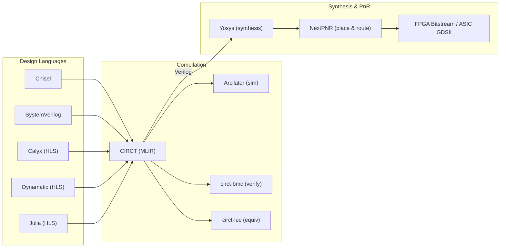

This page covers how CIRCT/MLIR integrates with existing hardware description languages and EDA tools, and surveys real-world adoption of these tools in industry and research.

## Integration with Existing HDLs

### Chisel / FIRRTL — The Primary Frontend

Chisel is a hardware construction language embedded in Scala, and FIRRTL (Flexible Intermediate Representation for RTL) is its compiler IR. The CIRCT integration is the most mature frontend path:

**Compilation flow**:
1. Chisel elaboration produces CHIRRTL (Chisel-specific FIRRTL extensions)
2. `firtool` (CIRCT's FIRRTL compiler) ingests the FIRRTL text format
3. The `firrtl` dialect is progressively lowered through High/Mid/Low FIRRTL forms
4. Lowering converts `firrtl` to `hw` + `comb` + `seq` + `verif` + `ltl`
5. Final emission produces SystemVerilog

**Performance**: The MLIR-based FIRRTL Compiler (MFC) provides 10-100x speedup over the legacy Scala FIRRTL Compiler (SFC), thanks to C++ implementation and MLIR's efficient data structures. SiFive's `chisel-circt` library provides a drop-in replacement interface.

**Chipyard ecosystem**: The Chipyard SoC design framework (UC Berkeley) uses CIRCT as its compilation backend. Designs are elaborated in Chisel, compiled through `firtool`, and can be simulated via Arcilator, Verilator, or commercial tools.

### Zaozi — Direct MLIR Construction (2025)

Presented at LATTE '25, Zaozi reinvents the Chisel concept in Scala 3 but directly constructs MLIR using CIRCT's C-API, bypassing the textual FIRRTL serialization step entirely. This eliminates serialization overhead and accelerates elaboration. Zaozi also introduces a sound, reference-based type system for Register, Wire, IO, and Probe, making the Scala runtime types immutable.

### Amaranth HDL (formerly nMigen)

Amaranth is a Python-based hardware definition language with its own toolchain. It currently targets:
- Yosys (open-source synthesis) via RTLIL
- Vendor tools via generated Verilog

There is no direct CIRCT/MLIR integration. Integration between Amaranth and CIRCT-based flows happens through Verilog as an interchange format. The LiteX SoC builder can integrate Amaranth cores by first generating them as Verilog.

### SpinalHDL

SpinalHDL is a Scala-based HDL (separate from Chisel) that can emit VHDL or Verilog. It has no direct CIRCT integration, but adding RTLIL or FIRRTL backends has been noted as feasible. Like Amaranth, integration with CIRCT-based tools currently goes through Verilog.

### Bluespec SystemVerilog (BSV)

Bluespec uses guarded atomic actions (rules) to describe hardware. While conceptually aligned with some CIRCT concepts (particularly the dynamic scheduling in the Handshake dialect), there is no direct integration. Bluespec compiles to Verilog, which could be ingested by CIRCT's Moore dialect.

### Current State of HDL Integration

The hardware design ecosystem currently relies on **Verilog as the universal interchange format**. Even as new DSLs avoid VHDL/Verilog at the source level, Verilog remains the bridge between tools. CIRCT's long-term vision is to provide a richer interchange at the MLIR level, but this requires:
1. Mature frontends for each HDL (currently only Chisel/FIRRTL is production-ready)
2. Agreement on common abstractions (the `hw`/`comb`/`seq` dialects serve this role)
3. Community adoption of MLIR-based tooling

## ESI: Elastic Silicon Interconnect

ESI is a CIRCT dialect (originally from Microsoft) that addresses the SoC interconnect problem.

### The Problem

Wire signaling protocols in FPGA/ASIC design are ad-hoc. Even "standard" protocols like AXI have many minor variants. Connecting IP blocks requires manual adaptation of signaling, data widths, and timing — a major source of integration bugs.

### ESI's Solution

- **Typed channels**: Point-to-point connections with rich data types (ints, structs, arrays, unions, variable-length lists). The width of a channel is not necessarily the same as the message width.
- **Latency-insensitive semantics**: FIFO-based flow control. Modules communicate without assuming fixed latency.
- **Windowing**: Large messages can be broken into frames, trading bandwidth for wire area.
- **Service abstraction**: The ESI compiler chooses the communication substrate (AXI, Avalon-MM, custom) based on requirements.
- **Software bridge**: ESI creates high-level APIs for host software to communicate with hardware modules using typed messages, abstracting away DMA, MMIO, and device drivers.

### Cosimulation

ESI provides cosimulation endpoints that bridge hardware simulation (Arcilator) with software testbenches, enabling hardware-software co-verification through typed channels.

## FPGA-Specific Tooling on MLIR

### AMD/Xilinx AIR Dialect

AMD's AIR (AI Runtime) dialect targets their Versal AIE (AI Engine) architecture. It transforms `scf.for` loops into ping-pong buffering patterns for the AIE array, constructing dependency edges for concurrent communication and compute. The ARIES project (FPGA '25) builds on this for a unified MLIR-based AIE compilation flow.

### dfg-mlir — Dataflow Graph Dialect

A dialect for modeling static dataflow graphs, used with the Multi-Dataflow Composer (MDC) tool to generate synthesizable FPGA accelerators from high-level dataflow specifications.

### FOSDEM 2026: NPU Generation from Linalg

A work-in-progress flow generates custom NPU hardware directly from algorithm specifications, starting from MLIR's Linalg dialect and automatically producing synthesizable SystemVerilog via CIRCT. This "algorithm-first" approach inverts the traditional flow where hardware is designed first and then programmed.

### Google XLS

Google's XLS (eXtensible Language & Synthesis) is a separate HLS infrastructure that compiles a custom IR to Verilog. While not MLIR-based, there is ongoing exploration of integrating XLS as a backend for hls4ml, potentially complementing CIRCT-based flows.

## Real-World Adoption

### Production Use

| Organization | Usage | Status |
|-------------|-------|--------|
| **SiFive** | CIRCT/firtool as the Chisel backend for RISC-V core design. Arcilator for simulation. VCIX dialect for custom AI accelerator targeting. | Production |
| **Google** | MLIR widely deployed internally. Contributed to CIRCT's founding. XLS for internal HLS. | Production (MLIR); Research (CIRCT) |
| **Microsoft** | ESI dialect development. FPGA-based accelerator flows. Hot Chips 2022 tutorial on CIRCT. | Research/Production |
| **AMD/Xilinx** | AIR dialect for Versal AIE. Participants in CIRCT weekly meetings. | Research/Production |
| **Apple** | MLIR adoption (unspecified hardware applications). | Production (MLIR) |
| **Intel** | MLIR adoption. | Production (MLIR) |
| **NVIDIA** | MLIR adoption. | Production (MLIR) |
| **ARM** | MLIR adoption. | Production (MLIR) |

### Research Groups

| Institution | Project | Focus |
|------------|---------|-------|
| **Cornell (CAPRA)** | Calyx, HeteroCL, Allo | HLS compiler infrastructure, ML accelerators |
| **EPFL (LAP)** | Dynamatic | Dynamic scheduling HLS |
| **ETH Zurich** | Dynamatic, K-CIRCT, formal verification | Dynamic HLS, formal methods |
| **UIUC (Chen Lab)** | ScaleHLS, HIDA | Scalable HLS, hierarchical dataflow |
| **UC Berkeley** | Chipyard | Full SoC design framework on CIRCT |
| **CERN** | hls4ml, Fast ML | Ultra-low-latency ML inference on FPGAs |

### Conference Presence

CIRCT/MLIR hardware work appears regularly at:

- **LLVM Developers' Meeting**: Annual MLIR workshop, Arcilator tech talks
- **ASPLOS**: Calyx (2021), HIDA (2024)
- **HPCA**: ScaleHLS (2022)
- **FPGA**: ARIES (2025), multiple HLS papers
- **LATTE**: Workshop on languages, tools, and techniques for accelerator design (co-located with ASPLOS). Zaozi, JuliaHLS presented at LATTE '25.
- **FOSDEM**: Open-source hardware track. NPU generation talk at FOSDEM 2026.
- **Hot Chips**: SiFive/Microsoft CIRCT tutorial (2022)
- **DAC**: ScaleHLS (2022), various MLIR-related papers
- **C4ML**: PyTorch-to-Calyx (2026)
- **FPGA Horizons London 2025**: Talk on MLIR/CIRCT reshaping FPGA compiler tools

### Maturity Assessment (as of early 2026)

**Production-ready components**:
- `firtool` (FIRRTL compiler) — actively used by SiFive and the Chipyard ecosystem
- MLIR core infrastructure — widely deployed across industry
- `hw`/`comb`/`seq` core dialects — stable, well-tested

**Research-to-production transition**:
- Arcilator — competitive with Verilator, actively developed at SiFive
- Calyx — moving from research to broader adoption via PyTorch flow
- ESI — Microsoft-driven, evolving rapidly

**Active research**:
- Dynamatic — strong academic results, not yet industry-adopted
- ScaleHLS — impressive benchmarks, backend integration ongoing
- Moore dialect (SystemVerilog frontend) — 73% compliance, needs more coverage
- Formal verification — demonstrated on OpenTitan, tooling maturing

**Key limitation**: The CIRCT library's capabilities were identified as the main limiting factor in recent HLS work (JuliaHLS, 2025), particularly around memory modeling, cosimulation, and coverage of advanced SystemVerilog features. The ecosystem is rapidly expanding but not yet a complete replacement for commercial EDA tools.

## The Open-Source Hardware Tooling Landscape

CIRCT/MLIR sits at the center of a broader open-source hardware ecosystem:

The Yosys/NextPNR open-source synthesis and place-and-route tools complete the picture for a fully open-source FPGA design flow. CIRCT handles the "front half" (design capture, optimization, verification, code generation) while Yosys/NextPNR handle the "back half" (synthesis, mapping, placement, routing).

## References

- [SiFive chisel-circt](https://github.com/sifive/chisel-circt)
- [Zaozi: Reinvent Chisel in Scala 3 (LATTE '25)](https://capra.cs.cornell.edu/latte25/paper/12.pdf)
- [Hot Chips 2022: CIRCT Tutorial](https://www.hc34.hotchips.org/assets/program/tutorials/MLIR/HC2022.SiFive-MSFT.LenharthDemme.v1.pdf)
- [MLIR Users Page](https://mlir.llvm.org/users/)
- [CIRCT Project](https://circt.llvm.org/)
- [ESI Dialect](https://circt.llvm.org/docs/Dialects/ESI/)
- [Microsoft ESI GitHub](https://github.com/microsoft/Elastic-Silicon-Interconnect)
- [Amaranth HDL](https://github.com/amaranth-lang/amaranth)
- [FPGA Horizons London 2025](https://www.fpgahorizons.com/london-25/london-25-talks/)
- [FOSDEM 2026: NPU Generation from Linalg](https://fosdem.org/2026/schedule/event/GTQRZE-programmable-npu-generation-from-linalg-mlir-circt/)
- [ARIES FPGA '25](https://www.csl.cornell.edu/~zhiruz/pdfs/aries-fpga2025.pdf)
